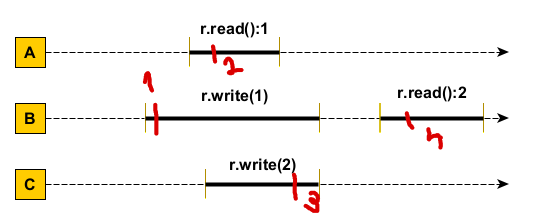
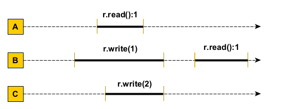
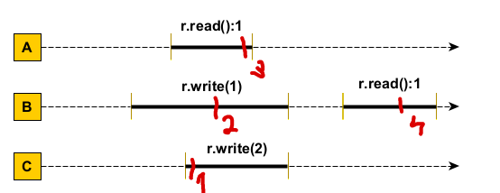

1. Se dau urmatoarele secvente (istorii) de executie de mai jos. Sunt acestea linearizabile? Dar consistent secventiale? (2 puncte)

# Secventa 1

## Linearizabil: Da
## Consistent secvential: Da

# Secventa 2

## Linearizabil: Da
## Consistent secvential: Da

