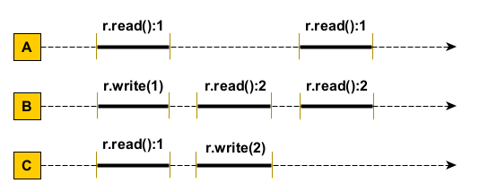
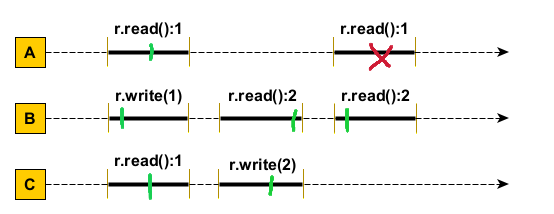
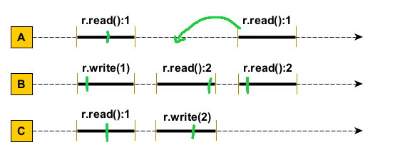

Secventa nu este liniarizabila. al doilea r.read():1 din A are loc strict dupa r.write(2) (intreg intervalul e mai la dreapta) si r.write(2) are loc strict dupa r.write(1). alt r.write(1) nu mai are loc.

Consistenta secventiala este:

