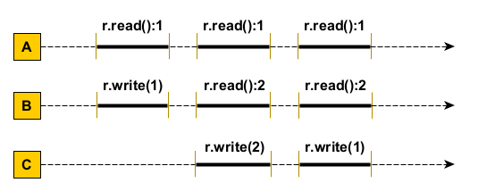

1. (2 puncte) Se da urmatoarea secventa (istorie) de executie de mai jos. Este aceasta linearizabila? Dar consistent secventiala? Se considera valoarea initiala r = 0.
Argumentati raspunsul oferind explicatiile (eventual secventa istoriei de executie) si/sau o diagrama cu punctele de linearizare dupa caz.

