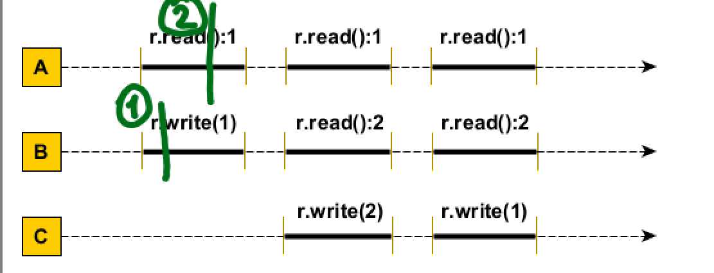
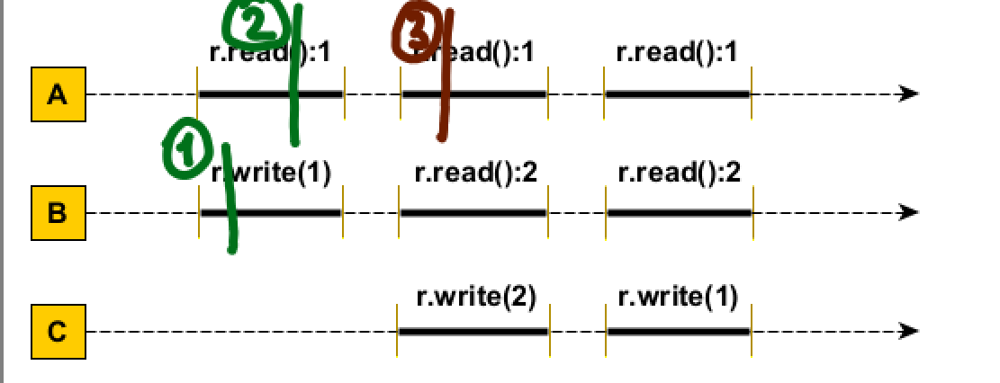
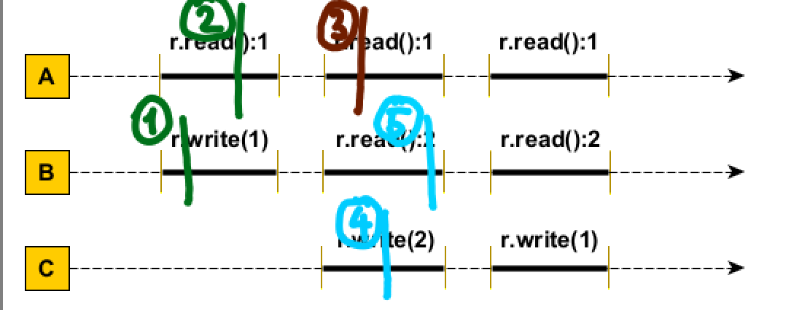
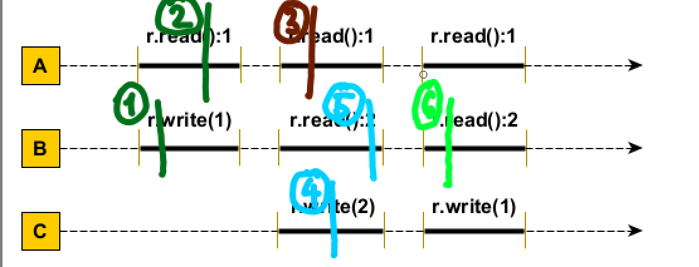
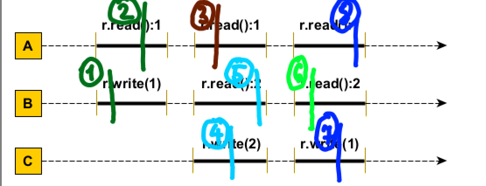

Initial r are valoarea 0. 

La primul pas observam ca A doreste sa citeasca 1 din variabila r si ca B doreste sa scrie 1 in variabila r deci prin urmare, ne mai avand alte cerinte hotoram sa scriem in r valoarea 1 din r iar apoi vom citi in A valoarea din r.

La urmatorul pas observam ca A doreste sa citeasca 1, B sa citeasca 2 iar C sa scrie 2. Avand deja 1 in variabila r hotoram sa citim 1 in A.

Acum au mai ramas B si C unde B doreste sa citeasca 2 iar C sa scrie 2. Avand in vedere ca in r acum avem 1 hotoram sa scriem in r valoarea 2 folosindu-ne de C iar apoi vom citi in B valoarea 2.

Acum observam ca A doreste sa citeasca 1, B doreste sa citeasca 2 iar C sa scrie 1. Avand deja in variabila r valoarea 2 decidem sa citim 2 in B.

Iar in final, A doreste sa citeasca 1 iar C sa scrie si prin urmare vom scrie 1 folosindu-ne de C iar apoi vom citi 1 la A.

!! Dupa itinerariul descris mai sus observam faptul ca este linearizabila iar conform teoriei de la curs, daca o secventa de executie este linearizabila atunci aceasta este si constistent secventiala.