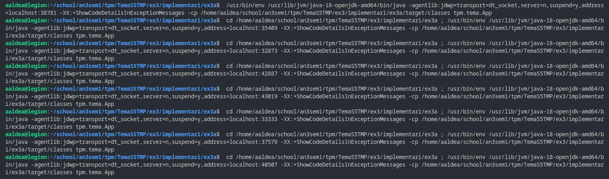

```java
 1|  class ShadyLock {
 2|      private volatile int turn;
 3|      private volatile boolean used = false;
 4|  
 5|      public void lock() {
 6|          int me = ThreadId.get();
 7|          do {
 8|              do {
 9|                  turn = me;
10|              } while (used);
11|              used = true;
12|          } while (turn != me);
13|      }
14|  
15|      public void unlock () {
16|          used = false;
17|      }
18|  }
```

Se observă din rularea implementării ca lock-ul nu este deadlock-free ( execuția programului ajunge la un stand-still și nimic nu mai face progres).



Fie doua thread-uri A si B. 
A apealză `lock()` si ajunge pana la linia 11. In același timp B apelează si el `lock()` și ajunge pâna la linia 9. În acest moment, `used` va fi setat pe `true` iar `turn` pe `B.ThreadId` deci ambele lock-uri re-intră in loop. A si B ramân amândouă blocate in loop-ul interior iar deoarece `used` este setat pe `true` orice alt thread care ar incercă sa preia lock-ul va fi și el blocat in loop. 

Într-un moment nici-un thread nu va mai fi in afara metodei `lock()` și deci întreg programul intră in deadlock.
